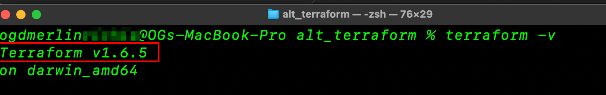
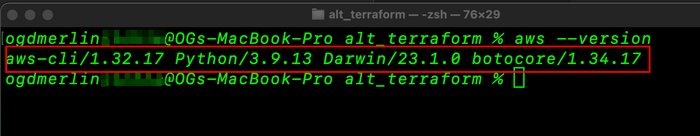
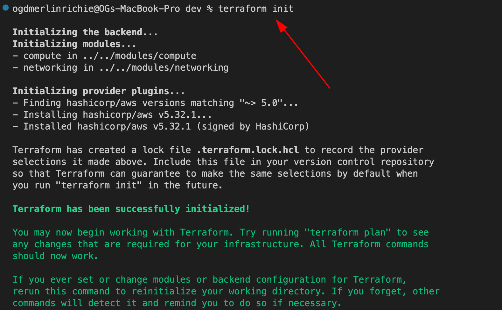
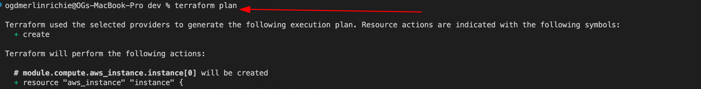
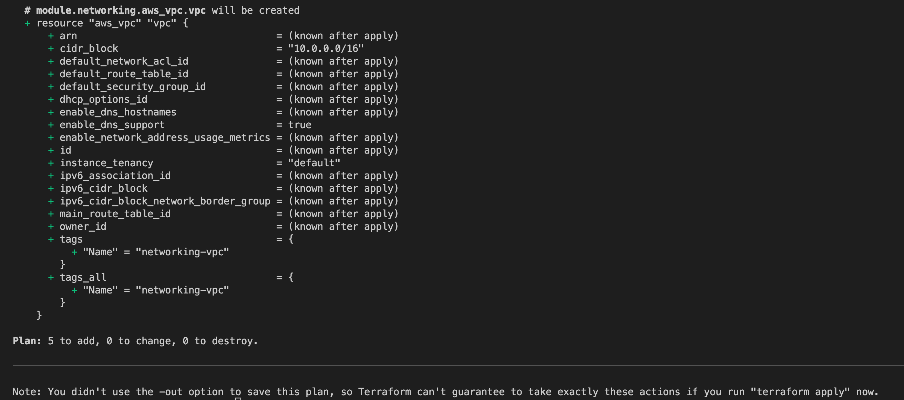
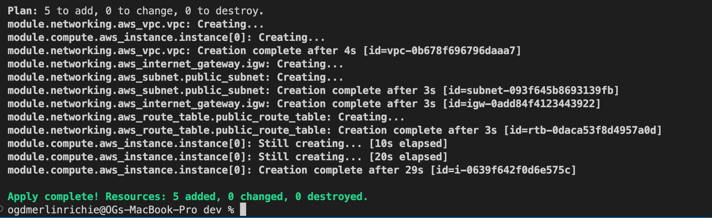
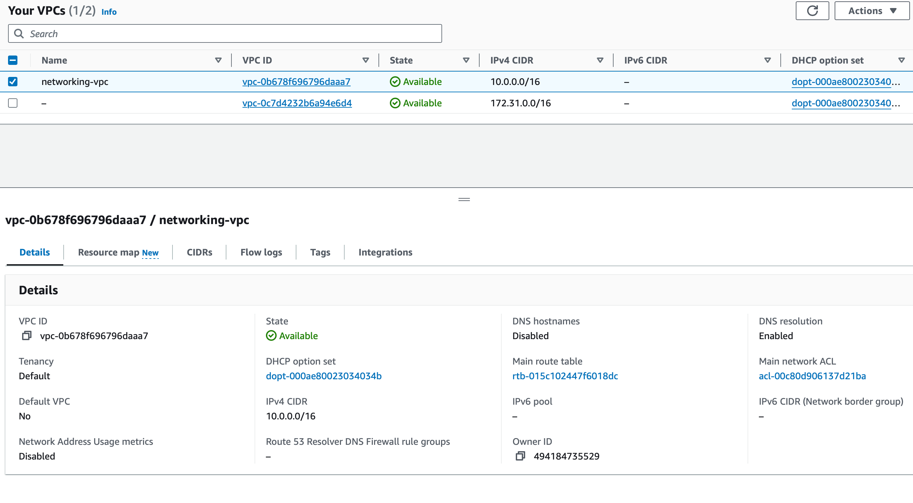
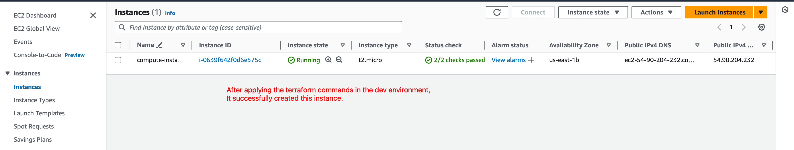
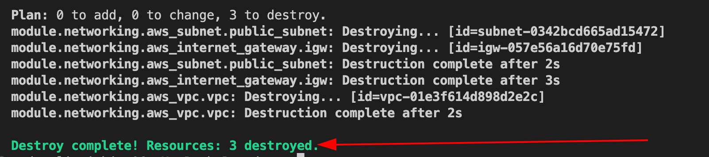

# Terraform AWS Infrastructure Deployment Documentation

## Overview

This Terraform project simplifies the deployment of AWS EC2 instances across multiple regions and availability zones, with a focus on reusability and configurability. Users can easily customize Ansible playbooks and Docker containers to suit their application and infrastructure requirements. This documentation provides comprehensive guidance on setting up and using the project effectively.

## Usage Instructions

Prerequisites
Terraform installed.
AWS account with configured credentials.
Familiarity with Ansible and Docker for script customization.

## Project Structure

Outlined below is the project structure, detailing the purpose of each directory and file:

```
terraform/
│
├── environments/
│   ├── dev/
│   ├── staging/
│   └── prod/
│
├── modules/
│   ├── compute/
│   │   ├── compute.tf
│   │   ├── variables.tf
│   │   └── outputs.tf
|   |
│   ├── networking/
│   │   ├── networking.tf
│   │   ├── variables.tf
│   │   └── outputs.tf
│
│
├── main.tf
├── variables.tf
├── outputs.tf
└── scripts/
    ├── ansible_playbook.yml
    └── Dockerfile
Question.md
README.md
```

- environments/: Contains environment-specific configurations for dev, staging, and prod.
- modules/: Houses the Terraform modules for compute and networking.
- main.tf: The main Terraform entry point.
- outputs.tf: Specifies Terraform outputs.
- scripts/: Contains scripts for Ansible playbook and Dockerfile.

#

## Terraform Configuration

The Terraform configuration is located in the modules/ec2_instance directory. The main.tf file contains the configuration for the AWS provider, the AWS instance, and the Ansible and Docker provisioners. The variables.tf file contains the variables used in the main.tf file. The outputs.tf file contains the outputs for the Terraform configuration.

## Terraform Environments

The Terraform environments are located in the environments directory. Each environment contains a main.tf file that references the Terraform configuration in the modules/ec2_instance directory. The main.tf file also contains the variables for the Terraform configuration.

## Terraform Modules

- ## EC2 Instance Module
  Responsible for creating AWS EC2 instances.
  Configuration parameters include the region, availability zones, instance type, and tags.
  Supports multi-region deployment and multiple availability zones.
- ## Ansible Playbook Module
  Manages the execution of Ansible playbooks on the EC2 instances.
  Utilizes a local Ansible playbook file for configuration.
  Environment variables are set to configure Ansible behavior.
- ## Docker Container Module
  Handles Docker containerization and deployment on the EC2 instances.
  Uses a local Dockerfile to build and run Docker containers.
  Triggered whenever the Dockerfile content changes.

#

## Usage

Clone this [repository](https://github.com/ogdmerlin/alt_terraform)

```
git clone this_repository

```

Navigate to the project directory (terraform/).

```
cd terraform
```

- Terraform Configuration:
  Ensure that Terraform is installed on your local machine.

- If not installed we can use the below command:

```
sudo apt-get update && sudo apt-get install -y gnupg software-properties-common curl
curl -fsSL https://apt.releases.hashicorp.com/gpg | sudo apt-key add -
sudo apt-add-repository "deb [arch=amd64] https://apt.releases.hashicorp.com $(lsb_release -cs) main"
sudo apt-get update && sudo apt-get install terraform
```

- Verify that the terraform is installed:

```
terraform -v
```



Configure AWS CLI with your AWS credentials using aws configure.

- For the latest version of the AWS CLI, use the following command block:

```
curl "https://s3.amazonaws.com/aws-cli/awscli-bundle.zip" -o "awscli-bundle.zip"
unzip awscli-bundle.zip
sudo ./awscli-bundle/install -i /usr/local/aws -b /usr/local/bin/aws
```

Verify that you have the AWS CLI installed

```
aws --version
```



- If you have the AWS CLI installed, you can update to the latest version by running the following command:

```
pip install --upgrade awscli
```

Use aws configure to configure your access key to your terminal as hardcoded access keys are considered bad practices

```
aws configure

#follow the prompt with the access keys gotten from the AWS console.
```

## Testing

Navigate to the project directory (terraform/).
Initialize Terraform by running:

```
terraform init
```



Run terraform plan to view the changes that will be applied.

```
terraform plan
```




Run terraform apply --auto-approve to apply the changes. The --auto-approve tag makes sure it runs automatically without asking for confirmation.

```
terraform apply --auto-approve
```



- The below image visually confirms successful VPC creation by Terraform.



- The below image visually confirms successful EC2 instance creation by Terraform.



- All Done.

#

Execute 'terraform destroy' to clean up resources after testing. Also, we use the '--auto-approve' tag to make sure it works without confirmation.

```
terraform destroy --auto-approve
```

  

#

## Best Practices

Always run terraform plan before applying changes.

Keep the AWS credentials secure and do not hardcode them in configurations.

Modularize resources for reusability and maintainability.

Execute 'terraform destroy' to clean up resources after testing.

Use Terraform workspaces to manage multiple environments.

Use Terraform state locking to prevent concurrent runs.

Use Terraform state backends to store state remotely.

Use Terraform modules to share configurations.

Use Terraform providers to manage resources.

Use Terraform variables to parameterize configurations.

Use Terraform outputs to view the results of Terraform runs.

Use Terraform functions to manipulate data.

Use Terraform conditionals to handle dynamic configurations.

Use Terraform loops to handle dynamic configurations.

Use Terraform dynamic blocks to handle dynamic configurations.

Use Terraform locals to define reusable values.

Use Terraform data sources to fetch data.

## References

[Terraform](https://https://www.terraform.io/docs/index.html)

[EC2](https://aws.amazon.com/pm/ec2/)

[AWS](https://aws.amazon.com)

[Ansible](https://docs.ansible.com/ansible/latest/index.html)

[Docker](https://docs.docker.com/)
